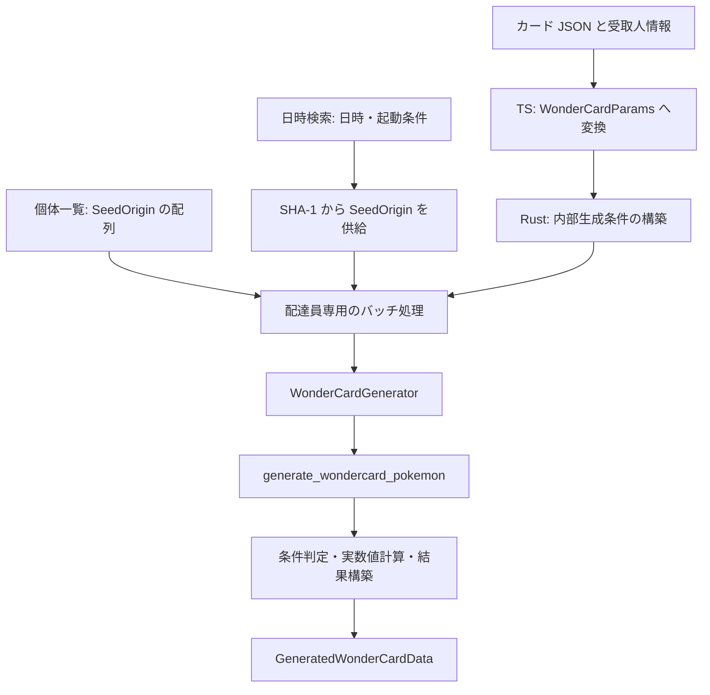

# 配達員の TS 境界・個体一覧・日時検索 仕様書

## 1. 概要

### 1.1 目的

[local_123 の一個体生成仕様](../../complete/local_123/WONDER_CARD_GENERATION.md) を、カード選択、TypeScript / WASM 境界、個体一覧、起動日時検索へ接続する。カード情報から生成条件への変換と、二つの実行経路の責務を定義する。

本書の対象を 2026-09-10 に実装・検証した。カード定義から TS / WASM 境界、CPU Worker による個体一覧・日時検索、共通結果型と表示変換までを扱う。

同日の [local_125](../local_125/WONDER_CARD_COLLECTION.md) で、同梱カードの型・配置・ローダーAPI・選択候補の表示材料を更新した。本書の初期3件と旧 `source` / `displayName` の記述は実装当初の記録とし、現在のカタログ契約は後続仕様を参照する。WASM・Workerの生成条件契約は維持している。

コード例には型定義と関数のシグネチャを示し、関数本体は省略する。

### 1.2 用語定義

| 用語 | 定義 |
|------|------|
| カード定義 | アプリに同梱する JSON に記録した、配布対象と生成条件のプリセット |
| 公開入力 | TS から WASM に渡す未検証の `WonderCardParams` |
| 内部生成条件 | `local_123` の `WonderCardGenerationParams`。構築時に検証済みの条件 |
| 起動候補 | 日時と単一の起動条件の組。SHA-1 から初期 LCG Seed を求める単位 |
| 個体候補 | 一つの `SeedOrigin` と、起動時消費を除いた一つの消費位置の組 |
| バッチ | 一回の同期 WASM 呼び出しで処理する個体候補の集合 |
| 実行時設定 | 開始時点のカード情報・生成条件・起動設定・範囲・フィルターの複製 |

### 1.3 背景・問題

内部生成条件は乱数計算に必要な項目だけを持つ。これらを画面で個別入力させると、利用者が配布ごとの固定条件や使用する TID / SID を判断する必要がある。カード定義を選択し、TS 側で公開入力へ変換する経路を設ける。

個体一覧は指定済みの Seed を使い、日時検索は起動候補から Seed を求める。Seed が決まった後の消費位置の列挙、生成、条件判定、結果構築は配達員の二経路で共有する。

既存の `PokemonGenerator` は MT 由来の個体値を Seed ごとに再利用する。配達員では個体値も消費位置ごとに LCG から求めるため、専用の `WonderCardGenerator` を設ける。

### 1.4 期待効果

| 項目 | 期待効果 |
|------|----------|
| 入力の簡略化 | カードを選択すると、固定条件と使用する ID が生成入力へ反映される |
| 経路間の一致 | 同じ個体候補と条件から、一覧・検索で同じ結果を得る |
| 検証の集約 | 内部生成条件を WASM オブジェクト構築時に一回検証し、Seed 切り替えとバッチ継続で再利用する |
| 中断への応答 | 一つの Seed の処理中でも候補数で区切り、Worker がキャンセルを受信できる |
| 結果の共用 | 一覧・検索で同じ結果型と表示変換を使用する |

### 1.5 着手条件

`local_123` の入力型・結果型・一個体生成関数を実装し、その生成結果と終了 LCG 状態の検証を終えてから接続する。対応するカード条件も同仕様の範囲に従う。

本書はカード定義の形式、変換関数、Rust の列挙・検索処理、WASM / Worker の呼び出し契約、表示データへの変換を対象とする。画面の配置、ナビゲーション、Store の永続化、全配布カードの網羅的な収集は別の作業とする。画面接続時に保持すべき実行時設定は本書で定義する。

## 2. 対象ファイル

以下は実装の配置。`local_123` の対象ファイルへの変更は、上位経路から接続するために必要なものに限る。

| ファイル | 変更種別 | 変更内容 |
|----------|----------|----------|
| `src/data/wondercards/schema.ts` | 新規 | カード定義の型 |
| `src/data/wondercards/data/v1/*.json` | 新規 | 根拠を確認したカード定義 |
| `src/data/wondercards/loader.ts` | 新規 | 同梱データの読み込み、対象 ROM とカード ID による選択 |
| `src/data/wondercards/converter.ts` | 新規 | カード定義と受取人情報から `WonderCardParams` への変換 |
| `src/data/wondercards/README.md` | 新規 | カード条件の出典、入力値の対応、将来の画面接続契約 |
| `wasm-pkg/src/types/generation.rs` | 変更 | `WonderCardParams`、`GeneratedWonderCardData`、色違い条件の公開型 |
| `wasm-pkg/src/types/search.rs` | 変更 | 配達員の日時検索入力、バッチ上限、バッチ結果 |
| `wasm-pkg/src/types/ui.rs` | 変更 | `UiWonderCardData` |
| `wasm-pkg/src/types/mod.rs` | 変更 | 新設する公開型の再エクスポート |
| `wasm-pkg/src/generation/flows/wondercard.rs` | 変更 | 公開段階で移動する色違い条件型の参照先を更新 |
| `wasm-pkg/src/generation/flows/types.rs` | 変更 | 内部生成エラーの `Display` / `Error` 実装 |
| `wasm-pkg/src/generation/flows/generator/wondercard.rs` | 新規 | 公開入力の変換、単一 Seed の Generator、配達員専用のバッチ処理と一覧処理 |
| `wasm-pkg/src/generation/flows/generator/mod.rs` | 変更 | 配達員モジュールの宣言と内部公開 |
| `wasm-pkg/src/datetime_search/wondercard.rs` | 新規 | 日時からの Seed 供給、日時検索器、タスク分割 |
| `wasm-pkg/src/datetime_search/mod.rs` | 変更 | 配達員モジュールの宣言 |
| `wasm-pkg/src/resolve/wondercard.rs` | 新規 | 配達員の結果を表示用データへ変換 |
| `wasm-pkg/src/resolve/mod.rs` | 変更 | 配達員の表示変換モジュールの宣言 |
| `wasm-pkg/src/lib.rs` | 変更 | WASM 公開用ラッパー、公開関数、型の再エクスポート |
| `src/workers/types.ts` | 変更 | 配達員の一覧・日時検索タスク、共通結果レスポンス |
| `src/workers/search.worker.ts` | 変更 | CPU 経路への接続とバッチ実行 |
| `src/services/search-tasks.ts` | 変更 | 配達員のタスク生成関数 |
| `src/services/worker-pool.ts` | 変更 | 結果型 Union に配達員の結果を追加 |
| `src/services/batch-utils.ts` | 変更 | 配達員の結果を扱う型ガード |
| `src/lib/result-view.ts` | 変更 | `WonderCardResultView` の追加 |
| `wasm-pkg/tests/wondercard_integration.rs` | 新規 | 一覧・検索・分割実行の一致検証 |
| `src/test/unit/wondercard-data.test.ts` | 新規 | カード定義、変換、結果型の判別の検証 |
| `src/test/integration/wondercard-worker.test.ts` | 新規 | WASM 境界、CPU Worker、表示変換の検証 |
| `spec/agent/architecture/rust-structure.md` | 変更 | 配達員モジュールの配置と責務 |
| `spec/agent/architecture/frontend-structure.md` | 変更 | カードデータの配置と TS の変換経路 |

`src/wasm/` の型・バインディングはビルドで更新し、手編集しない。

## 3. 設計方針

### 3.1 カード選択と乱数計算の責務

TS はカードを選択し、固定条件と使用する TID / SID を公開入力へ変換する。Rust は種族から性別比を解決し、検証済みの内部生成条件を構築する。カード名・カード ID・通常配布か配布タマゴかの区分は TS 側で扱う。

カード定義は生成条件のプリセットであり、カードごとの消費数や生成関数名は持たせない。消費順序と補正式は `local_123` の一個体生成に集約する。

### 3.2 二つの入口と共通処理



一覧は渡された `SeedOrigin` を順に使用する。日時検索は既存の `DatetimeSearchSpace` と `DatetimeHashGenerator` を利用して `SeedOrigin::Startup` を順次作る。両経路とも同じ `WonderCardGenerator` で消費位置を列挙する。

### 3.3 共通化の範囲

新しく共通化するのは配達員のカード変換、バッチ処理、フィルター適用、結果構築、表示変換とする。既存の `PokemonGenerator` / `EggGenerator` を統合する汎用 Generator や、全検索を統一する実行基盤は追加しない。

既存の `Lcg64`、起動時消費計算、日時列挙、`CoreDataFilter`、種族・実数値計算、`runSearchLoop`、`WorkerPool`、`useResultViews` は現在の責務のまま利用する。既存 resolver の全面的な共通化も本書の対象に含めない。

### 3.4 CPU による実行

個体一覧・日時検索は CPU / WASM で実行する。GPU 対応は行わず、GPU 用の入力型・設定・Worker 分岐は追加しない。これは対応範囲の決定であり、GPU と CPU の性能差を実測した結論ではない。

### 3.5 生成条件と実行状態の分離

公開入力から内部生成条件への変換は WASM オブジェクトの構築時に一回行う。内部生成条件はバッチ間で保持し、各 Seed の生成にも再利用する。

消費範囲、起動設定、フィルター、進捗、現在の Seed は上位の実行状態として扱う。`local_123` の内部生成条件に列挙・検索用のフィールドを追加しない。

## 4. 実装仕様

### 4.1 カード定義と TS での変換

カード定義は `src/data/wondercards/data/v1/` に配置する。同じ生成条件を複数 ROM で使用できる場合は、一つの定義の `versions` に列挙する。`id` は全定義を通して一意のアプリ内識別子とする。

以下は正規化済みカードの型定義。列挙型と `TrainerInfo` は生成済み WASM 型から参照する。実装の `WonderCardEntryJson` は、任意の固定条件に限って JSON の `null` も許容し、ローダーが `WonderCardEntry` へ正規化する。

```typescript
type FixedIvsJson = Partial<
  Record<'hp' | 'atk' | 'def' | 'spa' | 'spd' | 'spe', number>
>;

interface WonderCardCommon {
  id: string;
  displayName: { ja: string; en: string };
  versions: RomVersion[];
  speciesId: number;
  level: number;
  fixedIvs: FixedIvsJson;
  fixedNature?: Nature;
  fixedGender?: Exclude<Gender, 'Genderless'>;
  fixedAbilitySlot?: AbilitySlot;
  shinyPolicy: WonderCardShinyPolicy;
}

export type WonderCardEntry = WonderCardCommon & (
  | { kind: 'pokemon'; trainer: TrainerInfo }
  | { kind: 'egg'; trainer?: never }
);

export type WonderCardEntryJson = Omit<
  WonderCardCommon,
  'fixedIvs' | 'fixedNature' | 'fixedGender' | 'fixedAbilitySlot'
> & {
  fixedIvs: Partial<Record<keyof FixedIvsJson, number | null>>;
  fixedNature?: Nature | null;
  fixedGender?: Exclude<Gender, 'Genderless'> | null;
  fixedAbilitySlot?: AbilitySlot | null;
} & (
  | { kind: 'pokemon'; trainer: TrainerInfo }
  | { kind: 'egg'; trainer?: never }
);

export interface WonderCardCatalogJson {
  source: { name: string; url: string; retrievedAt: string };
  entries: WonderCardEntryJson[];
}

export function toWonderCardParams(
  card: WonderCardEntry,
  recipient?: TrainerInfo
): WonderCardParams;
```

`kind` は使用する ID の選択に用いる。`pokemon` はカードの `trainer`、`egg` は引数の `recipient` を公開入力の `trainer` に設定する。配布タマゴも同じ配達員生成を使用し、育て屋のタマゴ生成・遺伝処理には接続しない。

| カード定義 | 公開入力への変換 |
|------------|------------------|
| `speciesId`, `level` | `species_id`, `level` に設定 |
| `fixedIvs` | `hp, atk, def, spa, spd, spe` 順の長さ 6 の配列にする。省略された能力は未指定 |
| `fixedNature`, `fixedGender`, `fixedAbilitySlot` | 対応する `fixed_*` フィールドに設定。省略は未指定 |
| `shinyPolicy` | `shiny_policy` に設定 |
| `kind` と ID | 上記の規則で選んだ TID / SID 一組を `trainer` に設定 |
| `id`, `displayName`, `versions`, `source` | TS 側の選択・表示・データ管理に使用 |

JSON の未指定値はプロパティの省略で表す。`fixedIvs` が空オブジェクトなら六能力ともランダムであり、`0` は固定値として保持する。TS 内部では未指定を `undefined` に統一する。JSON 読み込み時に `null` を受け付ける場合は、その境界で `undefined` に正規化する。

ローダーは既存の同梱データと同様に `import.meta.glob` で読み込み、カード ID で取得できるようにする。選択候補は現在の ROM が `versions` に含まれるカードに限定する。選択中カードが存在しない場合や ROM と一致しない場合は、別カードに自動置換せず実行を開始しない。

JSON の同梱時検証では ID の重複、表示名、ROM 指定、`kind` と `trainer` の組み合わせを確認する。生成条件の値域・整合性は、カード全件を Rust の構築経路に通すテストで確認する。TS の変換関数に `local_123` の検証ロジックを複製しない。

最初に収録するカードは、`source` で生成条件の根拠を確認できるものに限る。カードの収録件数は本書では定めない。

初期収録は `secret-egg-pidove`、`spring-2013-meloetta`、`event11-zoroark` の 3 件。生成条件は PokeFinder の固定コミットにある入力データ、カード名・対象 ROM は配布アーカイブで確認した。詳細は `src/data/wondercards/README.md` に記録する。`versions` は ROM バージョンへの適合を示し、配布言語・リージョンの受信可否は表さない。

`loadWonderCards(version?)` は初回に JSON を非同期で並列読み込みし、メタデータ検証・正規化後の結果をキャッシュする。戻り値は複製し、利用側の編集をキャッシュへ反映しない。`getWonderCard(id, version)` は欠落 ID・対象外 ROM をエラーにする。配布タマゴの受取人未入力もエラーにし、通常配布では受取人が未入力でもカードの ID を利用する。

### 4.2 WASM に公開する生成入力

一覧と日時検索で同じ `WonderCardParams` を使用する。以下の構造体は転送用の未検証入力であり、`Tsify` / `Serialize` / `Deserialize` を付けて公開する。

```rust
pub struct WonderCardParams {
    pub trainer: TrainerInfo,
    pub species_id: u16,
    pub level: u8,
    pub fixed_ivs: [Option<u8>; 6],
    pub fixed_nature: Option<Nature>,
    pub fixed_gender: Option<Gender>,
    pub fixed_ability_slot: Option<AbilitySlot>,
    pub shiny_policy: WonderCardShinyPolicy,
}
```

TS は `gender_ratio` を渡さず、Rust が種族データから解決する。ROM と消費範囲は `GenerationConfig` に置く。カード ID、カード名、配布区分、消費数の補正値は公開入力に追加しない。

`local_123` で定義した `WonderCardShinyPolicy` は、この公開段階で `types/generation.rs` に移し、`Tsify` / `Serialize` / `Deserialize` を付ける。`Never` / `Random` / `Always` の意味は変えず、内部モジュールからも同じ型を参照する。検証済みの `WonderCardGenerationParams` には `Deserialize` を付けない。

`fixed_ivs` は必ず六要素とし、TS からは各要素の未指定を `undefined` で渡す。変換関数は生成済みの `WonderCardParams['fixed_ivs']` 型を利用する。配列長、未指定値、固定値 `0` を含む実際の受け渡しはブラウザの WASM 統合テストで確認する。

### 4.3 内部条件の構築と検証の責務

公開入力を直接一個体生成へ渡さず、配達員モジュール内の `PreparedWonderCardParams` へ変換する。この型は種族・レベルと内部生成条件を保持するための非公開フィールドを持ち、WASM へ公開しない。

```rust
pub(crate) struct PreparedWonderCardParams {
    generation: WonderCardGenerationParams,
    species_id: u16,
    level: u8,
}

impl TryFrom<WonderCardParams> for PreparedWonderCardParams {
    type Error = GenerationError;
    fn try_from(params: WonderCardParams) -> Result<Self, Self::Error>;
}
```

変換では種族 ID が `1..=649`、レベルが `1..=100` であることを確認してから種族データを参照する。解決した性別比と公開入力の固定条件を `WonderCardGenerationParams::new()` に渡す。固定個体値・性別指定の整合性は、このコンストラクターだけで検証する。

| 検証対象 | 実行する場所 |
|----------|--------------|
| カードの存在、選択 ROM、受取人情報の入力有無 | TS のカード選択・要求構築時 |
| 種族、レベル | `PreparedWonderCardParams::try_from()` |
| 固定個体値、性別比と性別指定 | `WonderCardGenerationParams::new()` |
| 消費範囲、起動設定、日時検索での ROM の一致 | WASM オブジェクト構築時に既存の設定検証を使用 |
| 日時範囲と起動条件の分割 | タスク生成時に既存の日時探索空間・起動条件展開を使用 |
| 各 Seed の起動時消費を足した位置のオーバーフロー | 単一 Seed の Generator 初期化時に既存の `initial_advance()` を使用 |

内部生成条件の構築は各 Worker の WASM オブジェクトごとに一回とする。タスク分割時には `WonderCardGenerationParams::new()` を呼ばず、公開入力を各タスクへ渡す。Worker をまたいで検証済み Rust オブジェクトを共有しない。

既存の起動設定・範囲ヘルパーが内部で行う検証は変更しない。一回に集約する対象は配達員の生成条件の検証であり、Seed に依存する起動時消費の計算は各 Seed で行う。

不正入力は構築エラーとして返す。Seed 切り替え時の初期化エラーも上位へ返し、その Seed を黙って除外しない。型付き内部エラーを WASM 境界で既存方式の文字列エラーへ変換する。

### 4.4 単一 Seed の `WonderCardGenerator`

`WonderCardGenerator` は Rust 内部で使用し、指定した一つの `SeedOrigin` について `[user_offset, max_advance]` の消費位置を扱う。生成条件には `PreparedWonderCardParams` を使用する。

公開する Rust 内部メソッド名は `new()`、`generate_next()`、`current_advance()`、`game_offset()`、`total_offset()`、`take(count)` とし、既存 Generator に揃える。`new()` は Seed 初期化の失敗を `Result` で返し、`generate_next()` は一致個体を `Option<GeneratedWonderCardData>` で返す。

初期化では `source.base_seed()` から起動時消費を計算し、`game_offset + user_offset` へジャンプする。ここではカード前処理を消費しない。

一候補の処理順は以下とする。

1. 現在の消費位置と、その位置でレポートを書いた場合の針方向を記録する。
2. 列挙用 LCG を複製し、`generate_wondercard_pokemon()` で一個体を生成する。
3. 列挙用 LCG と `current_advance` を一つ進める。
4. 生成結果にフィルターを適用し、一致個体を構築して返す。

`advance` は起動時消費を除いた位置であり、初回は `user_offset` とする。針方向も `local_123` のカード前処理前の受取開始位置に対応する。生成関数が消費した回数を、列挙用 LCG の進め幅に使わない。

`generate_next()` の `None` は候補の不一致を表す。バッチ処理は `current_advance() > max_advance` で単一 Seed の終了を判定し、終了後は呼び出さない。`take(count)` の `count` は一致数ではなく試行数とし、残りの消費範囲を超えて処理しない。

### 4.5 条件判定と結果型

両経路で `Option<CoreDataFilter>` を使用する。未指定または全条件未指定なら全候補を返す。個体値・めざめるパワー・性格・性別・特性・色違い・実数値の判定は、既存のフィルターの意味に従う。

一個体生成後、実数値に依存しない条件（個体値・めざめるパワー・性格・性別・特性・色違い）を判定し、通過した候補だけ実数値を計算する。次に実数値条件を判定して結果を返す。個体値は `RawWonderCardData.ivs` を使用し、MT の計算・個体値の Seed 単位のキャッシュは設けない。一個体生成関数の途中終了は追加しない。

```rust
pub struct GeneratedWonderCardData {
    pub advance: u32,
    pub needle_direction: NeedleDirection,
    pub source: SeedOrigin,
    pub core: CorePokemonData,
}
```

`core` には `RawWonderCardData` の個体情報と、検証済みの種族・レベル・計算した実数値を設定する。配布タマゴも選択カードが指定する種族を保持する。育て屋のタマゴ生成にある性別による種族変換は適用しない。

`source` は渡された生成元情報を保持する。日時検索でも同じ型を直接返し、結果専用の追加ラッパーは作らない。シンクロ、持ち物スロット、エンカウント結果、遺伝情報を埋めるためのダミーフィールドは追加しない。

### 4.6 配達員専用のバッチ処理

内部の `WonderCardBatchGenerator<S>` が、Seed 供給、現在の `WonderCardGenerator`、構築済み条件、設定・フィルター、進捗を保持する。`S` は `Iterator<Item = SeedOrigin>` とし、一覧の配列と配達員用の日時供給器に使用する。生成方式を型パラメーターにした汎用実行器にはしない。

一覧は `Vec<SeedOrigin>::into_iter()`、日時検索は `DatetimeHashGenerator::next_quad()` の取得結果を最大四件保持する供給器を使用する。全日時分の `SeedOrigin` を先にメモリへ展開しない。内部のバッチ型に日時計算を直接持たせず、日時供給器は `datetime_search/wondercard.rs` に置く。

```rust
pub struct WonderCardBatchLimits {
    pub max_candidates: u32,
    pub max_results: u32,
}

pub struct WonderCardSearchBatch {
    pub results: Vec<GeneratedWonderCardData>,
    pub processed_count: u64,
    pub total_count: u64,
}
```

上記の二型は一覧・日時検索で共有する公開型とする。進捗の `u64` は既存同様に TS の `bigint` へ変換する。

| 項目 | 契約 |
|------|------|
| 候補の単位 | `SeedOrigin` 一件と消費位置一つの組 |
| 消費位置数 | `GenerationConfig::advance_count()` による `max_advance - user_offset + 1` |
| 総候補数 | 一覧は入力 Origin 数、日時検索はタスク内の日時候補数に消費位置数を掛ける。`u64` の乗算を検査する |
| 処理済み件数 | 不一致を含む試行数。バッチ間で累積する |
| 上限 | 試行数が `max_candidates`、または返却数が `max_results` に達したら返す |
| 再開 | 次の未処理候補から続行する。Seed・消費位置・先読みした Origin を保持する |
| 終了 | 全候補の処理後に `is_done = true`。終了後の `next_batch()` は空結果と最終進捗を返す |
| 空の探索 | 有効な条件で Origin または日時候補がゼロなら、構築直後から完了状態 |

両上限は正数を必須とする。ゼロの上限は実行状態を進めずエラーにする。`max_results` は一回の返却上限であり、検索全体の打ち切り件数には使用しない。

一つのバッチが Seed の終端を越える場合は、残りの上限まで次の Seed を処理する。各結果の `source` と `advance` はその候補の値を保つ。

### 4.7 WASM 公開 API

公開用の薄いラッパーと `#[wasm_bindgen]` 注釈は `lib.rs` に置く。列挙・検索ロジックはそれぞれの内部モジュールへ委譲する。以下はシグネチャであり、本体とマクロ注釈は省略する。

```rust
impl WonderCardListGenerator {
    pub fn new(
        origins: Vec<SeedOrigin>,
        params: WonderCardParams,
        config: GenerationConfig,
        filter: Option<CoreDataFilter>,
    ) -> Result<Self, String>;

    pub fn next_batch(
        &mut self,
        limits: WonderCardBatchLimits,
    ) -> Result<WonderCardSearchBatch, String>;

    pub fn is_done(&self) -> bool;
}

pub struct WonderCardDatetimeSearchParams {
    pub ds: DsConfig,
    pub search_space: DatetimeSearchSpaceParams,
    pub condition: StartupCondition,
    pub wondercard_params: WonderCardParams,
    pub gen_config: GenerationConfig,
    pub filter: Option<CoreDataFilter>,
}

impl WonderCardDatetimeSearcher {
    pub fn new(params: WonderCardDatetimeSearchParams) -> Result<Self, String>;

    pub fn next_batch(
        &mut self,
        limits: WonderCardBatchLimits,
    ) -> Result<WonderCardSearchBatch, String>;

    pub fn is_done(&self) -> bool;
}

pub fn generate_wondercard_search_tasks(
    context: DatetimeSearchContext,
    wondercard_params: WonderCardParams,
    gen_config: GenerationConfig,
    filter: Option<CoreDataFilter>,
    worker_count: u32,
) -> Result<Vec<WonderCardDatetimeSearchParams>, JsValue>;
```

TS では `new` をコンストラクター、`is_done` を getter として公開する。処理完了・キャンセル・失敗時の `free()` は wasm-bindgen の生成する解放処理を使用する。

一覧も状態を保持する API を入口とし、全件を同期で返す `generate_wondercard_list()` は追加しない。内部の小規模な検証には `WonderCardGenerator::take()` を使用できる。

日時検索は `ds.version` と `gen_config.version` の一致を必須とする。`DatetimeSearchSpace` の候補から SHA-1、初期 LCG Seed、起動時消費、各消費位置の個体生成へ進む。MT Seed の一致検索や、個体値から MT Seed を探す処理には接続しない。

### 4.8 タスク分割と Worker

TS には `createWonderCardListTasks()` と `createWonderCardDatetimeSearchTasks()` を追加する。両方とも変換済みの同じ `WonderCardParams` と `GenerationConfig`、`CoreDataFilter` を受け取る。

一覧の初期実装は、既存の `splitOrigins()` で Origin 配列を Worker 数に応じて分割する。単一 Origin は一タスクとし、候補単位のバッチで中断可能にする。消費範囲を Worker 間で分割する最適化は、この段階では追加しない。

日時検索は `generate_wondercard_search_tasks()` で Timer0 / VCount / キー入力を展開し、既存の日時探索空間の分割を利用する。分割後の各タスクは単一の `StartupCondition` を持つ。空の日時探索空間には空のタスク配列を返し、先頭要素を仮定してアクセスしない。

起動条件の範囲が重なる場合は、同じ Timer0 / VCount / キー入力の組を一度だけ展開する。分割後に候補がない時間区間はタスクにしない。公開の `DateRangeParams` は少なくとも一日を表すため、空区間の構築は下位の `WonderCardDatetimeSearchParams.search_space` で扱う。TS の両タスク生成関数は正の `u32` 整数の Worker 数を要求する。

```typescript
interface WonderCardListTask {
  kind: 'wondercard-list';
  origins: SeedOrigin[];
  params: WonderCardParams;
  config: GenerationConfig;
  filter: CoreDataFilter | undefined;
}

interface WonderCardDatetimeSearchTask {
  kind: 'wondercard-datetime';
  params: WonderCardDatetimeSearchParams;
}

interface WonderCardResultResponse {
  type: 'result';
  taskId: string;
  resultType: 'wondercard-list';
  results: GeneratedWonderCardData[];
}
```

`SearchTask` / `WorkerResponse` / `SearchResultType` / `SearchResult` に上記の型を追加する。日時検索と一覧の結果レスポンスは同じ `resultType` を使用する。

`search.worker.ts` はタスク開始時に対応する WASM オブジェクトを一つ構築し、`runSearchLoop` 内で `next_batch()` を呼ぶ。上限の初期値は既存の個体条件検索に揃えて `max_candidates = 1024`、`max_results = 256` とする。これは処理単位の初期設定であり、応答時間の保証値ではない。

バッチ間で制御を返し、キャンセルを受信したら次のバッチを開始せず解放する。初期化時のエラーも既存の Worker エラーレスポンスで通知する。配達員タスクの呼び出し側は `useSearchConfig(false)` を使用する。

進捗は Rust が返す累積試行数を既存の集約処理へ渡す。表示が並列タスクの完了順になっても、結果の同一性は `source` と `advance` で判定する。同じ初期 Seed を持つ別日時の `SeedOrigin` は、別の起動候補として保持する。

配達員の結果判別に、`core` と `advance` の存在だけを確認する既存の `isGeneratedPokemonData()` を使用しない。レスポンスでは `resultType` で判別し、結果配列だけを受け取る既存の集約経路では、既知の結果型 Union に対する配達員用型ガードを設ける。通常個体の `sync_applied`、育て屋のタマゴの `inheritance` を持つ結果を配達員として受け付けない。判別のためのフィールドを各個体へ追加しない。

### 4.9 表示変換と実行時設定

`resolve_wondercard_data_batch()` を追加し、一覧・日時検索で共有する。

```rust
pub fn resolve_wondercard_data_batch(
    data: Vec<GeneratedWonderCardData>,
    locale: &str,
) -> Vec<UiWonderCardData>;
```

| 表示情報 | `UiWonderCardData` のフィールド |
|----------|-------------------------------|
| 消費位置・針 | `advance`, `needle_direction` |
| 生成元 | `base_seed`, `datetime_iso`, `timer0`, `vcount`, `key_input` |
| 個体の名称・分類 | `species_name`, `nature_name`, `ability_name`, `gender_symbol`, `shiny_symbol` |
| 個体の値 | `level`, `ivs`, `stats`, `hidden_power_type`, `hidden_power_power`, `pid` |

同名フィールドの型と表示形式は既存の `UiPokemonData` に揃える。日時などの起動情報は `SeedOrigin::Startup` の場合に設定する。配達員の計算に使用しない MT Seed と、エンカウント固有の表示項目は含めない。

表示変換は種族・特性名などの既存データ参照関数を使い、生成時の個体情報を再抽選しない。入力と同じ件数・順序で返す。TS では `WonderCardResultView = ResultView<GeneratedWonderCardData, UiWonderCardData>` とし、既存の `useResultViews` を利用できるようにする。

画面接続時は、カード ID・表示名と、変換済みの生成条件・起動設定・範囲・フィルターを開始時に複製して保持する。実行中のカード選択や受取人情報の変更で、既に開始したタスクや結果の意味を変更しない。

検索結果を個体一覧へ渡す操作を追加する場合は、選択した結果の `source` と実行時の生成条件・起動設定を引き継ぐ。受取人の現在値から条件を作り直したり、現在のカード定義を引き直したりしない。周辺消費を調べるための範囲と表示フィルターは、転記先の操作として扱う。画面と転記操作そのものの実装は本書の対象外とする。

## 5. テスト方針

### 5.1 確認する契約

| 分類 | 対象 | 検証内容 |
|------|------|----------|
| カード定義 | 同梱 JSON | ID の一意性、表示名、対象 ROM、配布区分と ID 指定の整合性 |
| TS 変換 | 通常配布・配布タマゴ | 使用する ID、固定個体値の能力順、未指定、固定値 `0`、元データを変更しないこと |
| 構築時検証 | 公開入力 | 種族・レベルの範囲外、不正な固定個体値・性別を拒否し、TID / SID の `0` を受け付ける |
| WASM 型変換 | 実際のバインディング | 六要素の `fixed_ivs` と `undefined`、列挙型、`bigint` の Seed・進捗が往復すること |
| 単一 Seed | Generator と低層関数 | 各受取開始位置からの結果、`advance`、針方向の一致。個体値を別候補から使い回さないこと |
| 条件の再利用 | 複数 Seed・複数バッチ | 内部生成条件の構築が一オブジェクトにつき一回であり、不一致でも一候補進むこと |
| バッチ継続 | 候補上限・結果上限・Seed 境界 | 分割の大きさによらず結果と進捗が一致し、重複・欠落がないこと |
| 境界値 | 空入力・消費範囲・上限 | 一位置だけの範囲、逆転、`u32::MAX`、起動時消費との加算、総候補数のオーバーフロー、ゼロのバッチ上限 |
| 経路の一致 | 一覧と日時検索 | 同一の Origin 群・生成条件・消費範囲・フィルターで同じ個体集合を返すこと |
| タスク分割 | 単一・複数 Worker | 同じ日時と起動条件の組を一回ずつ処理し、同じ Seed を持つ別日時を消さないこと |
| Worker | 二種類のタスク | 結果型、累積進捗、空結果、完了、キャンセル、構築失敗の通知 |
| 表示変換 | 共通結果型 | 入力との件数・順序の一致、隠れ特性、色違い、確定した個体値、種族・レベル・実数値の表示 |

低層生成との比較だけを正しさの根拠にせず、`local_123` の固定期待値を使った接続ケースも設ける。一覧と日時検索の比較では同じ `SeedOrigin` を使用し、並列実行の順序差を揃えて比較する。フィルターを適用した結果は、無条件の一覧へ同じ条件を適用した結果とも比較する。

同梱カードの全件を WASM の構築経路へ通す。メタデータの検証と乱数条件の検証を混同せず、カード定義に不正な値を追加したときに検出できるようにする。

### 5.2 実装時の検証

Rust の関連テスト、CPU Worker を使うブラウザ統合テスト、WASM ビルド、型チェック、フォーマット・Lint を実行する。検証コマンドはリポジトリの現行設定を使用する。配達員向けの GPU テストや GPU 性能測定は本作業に含めない。

2026-09-10 に以下を実行した。WASM の開発ビルド後に新規テストを通し、本番ビルドで生成し直した WASM でも関連するブラウザ統合テストを実行した。エラーの文字列変換を WASM 公開境界へ揃えた最終修正後にも、Rust の配達員統合 9 件と Clippy、本番ビルド、ブラウザの配達員統合 14 件を再確認した。

| コマンド | 結果 |
|----------|------|
| `cargo test -p wasm-pkg` | 単体 342 件・統合 17 件が成功。既存の性能測定 2 件は `ignored` |
| `pnpm exec vitest run --project unit` | 116 ファイル、1,453 件成功。カード・型ガードの最終修正後に対象 2 ファイル 19 件も再確認 |
| `pnpm exec vitest run --project integration src/test/integration/wondercard-worker.test.ts src/test/integration/pokemon-list-worker.test.ts src/test/integration/egg-list-worker.test.ts src/test/integration/pokemon-datetime-search.test.ts src/test/integration/generation-parallel.test.ts src/test/integration/services/worker-pool.test.ts src/test/integration/services/search-tasks.test.ts src/test/integration/wasm-binding.test.ts` | 8 ファイル、66 件成功。配達員 14 件を含む。既存の `wasm-binding` に含まれる GPU 疎通テストも実行されたが、配達員の GPU 処理・性能測定は追加していない |
| `pnpm build:wasm:dev` | 成功。生成済み型の六要素・未指定値を確認 |
| `pnpm build` | 成功。WASM 最適化、TypeScript、Vite を含む。初回は wasm-bindgen の一時ディレクトリ権限で失敗し、同じコマンドを権限を整えて再実行 |
| `pnpm lint` | oxlint と Rust Clippy が成功 |
| `pnpm exec tsc -b --noEmit` | 成功 |
| `pnpm format:check` | oxfmt と rustfmt が成功 |

既存依存 `wgpu v28.0.0` の将来互換性警告、Vite のチャンクサイズ警告、既存 UI テストの `act` / Dialog 説明警告は残る。実機の配布個体との照合は未実施。

### 5.3 要件と検証の対応

| 契約 | 確認した根拠 |
|------|----------------|
| 条件検証の一回化 | `PreparedWonderCardParams::try_from()` の構築回数をテスト内で計測。3 Seed・複数バッチ・全候補不一致でも一回。タスク分割はカード条件を検証せず、各 WASM オブジェクトが検証するケースも確認 |
| 独立した生成期待値 | `local_123` の開始状態へ 100 消費で到達する初期 Seed `0x5350281A0168543C`、起動時消費 43、追加消費 57 を使用し、PID `E9A92FBC` と個体値 `17/16/22/19/14/24` を Rust とブラウザで照合 |
| 参照実装との接続 | PokeFinder の Pidove 固定期待値を絶対消費位置 43・44 で照合。参照実装の先頭位置は 39、この repo の既存起動計算の先頭位置は 43 のため、表示上の先頭行同士を比較しない。起動計算は本仕様どおり既存処理を再利用しており、この比較を実機検証の代用にはしない |
| 位置・針・個体値 | 受取開始位置の低層生成・レポート針との照合、隣接候補で異なる個体値、`take()` の範囲末尾を確認 |
| バッチ継続と入力境界 | 候補上限・結果上限・Seed 境界・四件取得の端数、空入力、一位置、逆転、`u32::MAX`、起動消費の加算、`u64` 総数オーバーフロー、ゼロ上限、次 Seed 初期化失敗の再通知を確認 |
| 一覧・日時検索・条件判定 | BW / BW2 の四 ROM で一覧と日時検索が一致。個体値・めざパ・性格・性別・特性・色違い・実数値の後処理フィルターと比較。日時検索でも同じ個体値・実数値条件による部分集合を確認 |
| タスク・Worker | 同じ日時・起動条件を一度ずつ処理し、同 Seed の異なる日時を保持。CPU WorkerPool の結果・進捗を単一実行と比較。二タスクとも空結果・完了・構築失敗・単一 Seed の途中キャンセル・同じ Worker での再実行を確認 |
| カードと WASM 転送 | 同梱 3 カードを各対象 ROM の構築・生成へ通した。TID / SID の 0、固定個体値の 0・未指定・六要素、列挙型、Seed と進捗の `bigint`、入力を変更しないこと、不正カード値・配列長を検証 |
| 共通結果と表示 | 通常個体・育て屋タマゴとの型判別、入力順、隠れ特性、色違い、個体値、種族・レベル・実数値、Startup 情報を確認。表示型に MT Seed やエンカウントのダミー項目を追加していない |

## 6. 実装チェックリスト

- [x] カード定義・TS 境界・二つの実行経路を文書化する
- [x] CPU 実行と配達員経路内の共通化範囲を定める
- [x] カードの読み込み・変換と公開入力から内部条件への構築を実装する
- [x] 単一 Seed の Generator と二経路共通のバッチ処理を実装する
- [x] WASM API・日時タスク分割・CPU Worker を接続する
- [x] 共通結果型・表示変換・結果型の判別を実装する
- [x] 契約の検証を実行し、結果と構成資料を更新する

## 7. 関連資料

- [カード収集・JSON 生成の実装仕様](../local_125/WONDER_CARD_COLLECTION.md)
- [配達員の一個体生成仕様](../../complete/local_123/WONDER_CARD_GENERATION.md)
- [既存の個体条件による日時検索](../../complete/local_119/POKEMON_SEARCH_ENGINE.md)
- [既存の個体生成パイプライン](../../complete/local_120/POKEMON_GENERATION_PIPELINE.md)
- [Rust / WASM の構成](../../architecture/rust-structure.md)
- [TS 側の構成](../../architecture/frontend-structure.md)
